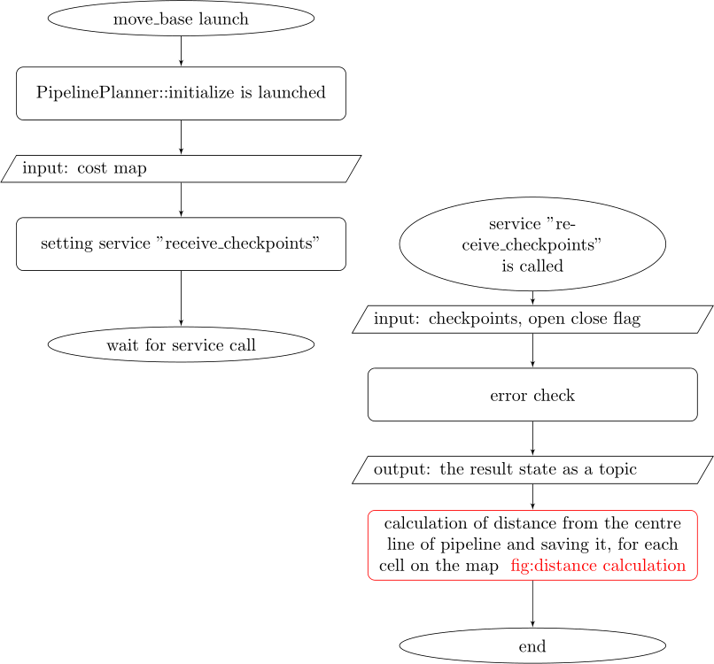
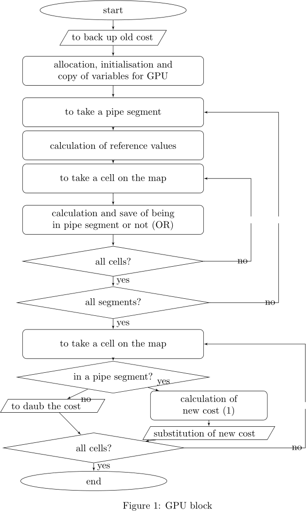
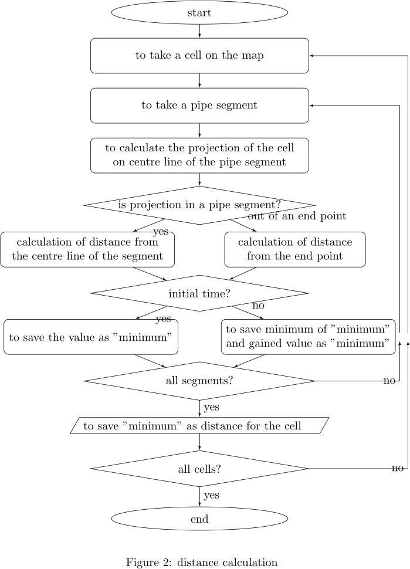

pipeline_planner ROS Package
=============================

### summary
pipeline\_planner is a kind of global planner.
It is designed to be used for a robot, especially nonholonomic robot, in a warehouse.
We assume a robot to follow a fixed route which is determined in advance for the warehouse.
We construct the fixed route by a series of checkpoints.
Connected checkpoints and radii of pipeline segments make "pipeline".
pipeline\_planner makes a global path in the pipeline.
For making the path, the planner veils the area out of the pipeline and call the global planner [NavFn](http://wiki.ros.org/navfn) on the edited global map.
So we need NavFn planner for dependency.
We explain them in detail in the next section.

This planner is described for kinetic version of ROS now.

### function
We can construct a pipeline by a series of checkpoints, an open close flag and radii for pipeline segments.
We cast these information by the service server "receive\_checkpoints".
Each pipeline segment is constructed by connecting sequential checkpoints together with the pipeline segment radius for it.
We can set the pipeline radii for pipeline segments as a positive value from 0.001 to 50 metre.
If we set values for some pipeline segments as 0.0, the radii uses a default value.
The default value is indicated by the dynamic parameter "pipe\_radius".
If we change the value "pipe\_radius", then radii for default set pipeline segments will change.
When we want to change a radius of a pipline segment, we can do it by calling the "set\_a\_radius" service.
A pipeline has a direction and a robot can't go backwards in the pipeline.
A series of checkpoints is an ordered points in a global map.
It must be in the global map.
It mustn't have a crossing after these checkpoints are connected to be a route.
A pipeline might be an open route or a close route.
Probably we use an open route as a one time only route because a robot can't go backwards in the route.

When we cast checkpoints with an open close flag, there might be an error.
So the planner has the status for reading checkpoints.
The status for reading checkpoints is immediately published on the topic "read\_checkpoints" when the planner receives the checkpoints.
And we can inquire the state at any time by the service "get\_read\_status".
We can use the planner when the value of the state is 3 or 5.
The list of the status will be described later.

After the planner receives proper checkpoints and open close flag, a robot is ready to move.
When the planner receives a global planning order from move\_base, it is, move\_base calls makePlan function of the global planner, the planner veils the costmap with "lethal\_cost" other than that in the pipeline and it makes a global path by calling the NavFn planner.
We can set "lethal\_cost" by the parameter of the same name.
It is not expected for a robot to move in one pipeline segment, it is, a region between two neighbouring checkpoints.
We can avoid the situation by making enough checkpoints.
We can adjust the parameter "centre\_weight" so as a robot to go in the middle of a pipeline.
If we want a robot to go in a little right hand side or in a little left hand side from the middle of a pipeline segment, then we can set it by the poses.orientation.y variables of a request in receive\_checkpoints service.
We can change the right shift or left shift parameter by the service "set\_a\_rightshift".
A robot might stop by an error.
We can gain the state of the robot by calling the service "get\_robot\_status".
2 or 3 is the welcome value.
The list of the robot status will be described later.

When makePlan is called start of calculation is informed by the topic
"inform\_status" with the value 12.
If the calculation completed normally, the end of calculation is informed by
the same topic with the value 3.
In a case of an error, the termination of the calculation is informed by the
same topic with the robot status value (again, it will be described later).

When makePlan calculation takes too much time, we can use torch model.
With the torch model, we can restrict the manipulation region, id est, the region in which we veil a cost or add a cost.
We can change the torch area by dynamic parameters, "torch\_area\_x" and "torch\_area\_y".

Two main functions are PipelinePlanner::initialize and
PipelinePlanner::makePlan.
'initialize' is called when move\_base is launched or pipeline\_planner is set to move\_base's global planner dynamically.
'makePlan' is called when global planner is called from move\_base.
This system uses [nav\_core](http://wiki.ros.org/nav_core) as a interface with move\_base.
These are common for any global planner.

pipeline\_planner can use CUDA for GPU calculation.
If we use CUDA, we need CUDA for dependency.
How to use CUDA is described in the Usage chaper.
### specification
The list for the status of reading checkpoints. (unsigned int)

 1. not yet read  
 2. reading now  
 3. OK  
 4. read but empty  
 5. route overlaps obstacle (permitted)  
 6. a part of the pipeline is out of costmap  
 7. openclose flag error  
 8. received pipeline has a crossing  
 9. the radius of a pipe segment is not valid  
 10. some sequential checkpoints are too close  
 others. unknown error  

If a status is one other than 3 or 5, it is error status.

The list for the status of robot after makePlan was called. (unsigned int)

 1. global planner is not yet initialised  
 2. the robot is ready to receive makePlan  
 3. global plan was made normally  
 4. the start is out of pipeline  
 5. all pipeline segments include start point  
 6. the goal is out of pipeline  
 7. all pipeline segments include goal point  
 8. goal is behind start (in the case of open pipeline only)  
 9. invalid check points (check "get\_read\_status")  
 10. global planner fails to make a plan  
 11. goal is behind start in one pipe segment  
 12. now calculating global path  
 13. calculation of local global goal fails, probably torch area should be widen  

If the status is one other than 2 or 3, it is error status.

About checkpoints.
The input format for checkpoints is geometry\_msgs::PoseArray.
In the format, we use "header.frame\_id", "poses.position.x", "poses.position.y", "poses.position.z" and "pose.orientation.y".
We can set a pipeline as a close loop or a open loop.
Probably you use an open loop as an one time only loop.

"header.frame\_id": The flag for whether the pipeline is close(value is 1) or open(value is 2).  
"poses.position.x" and "poses.position.y": The position of checkpoints.  
"poses.position.z": The radius of the pipeline segment.
If you set the value as 0.0, then it uses the dynamic parameter value "pipe\_radius".
You can change the value by the service "set\_a\_radius".  
"pose.orientation.y": The deviation from the middle of the pipeline segment into right hand side.
If you want a robot to go 0.5 metre right hand side from the middle of the pipeline segment in the pipeline segment, you should set the value as 0.5.
If you want left hand side, you should use a negative value.
You can change the value by the service "set\_a\_rightshift".


* Subscriptions:  
 * /move\_base/goal  
   type: move\_base\_msgs::MoveBaseActionGoal

 * /robot\_pose  
   type: geometry\_msgs::Pose

* Publications:  
 * ~/\<name>/read\_checkpoints  
   type: std\_msgs::UInt32  
   description: The result of checkpoints subscription in the reading
      checkpoints status form.

 * ~/\<name>/inform\_status  
   type: std\_msgs::UInt32  
   description: The result of robot status.

 * ~/\<name>/plan  
   type: nav\_msgs::Path  
   description: Global path especially for rviz visualisation.

 * ~/\<name>/robot\_position  
   type: pipeline\_planner::RobotPosition  
   description: To inform robot position of a pipe segment in the form.
      * in: Whether the robot is in the pipeline or not.
      * id: The ID of pipeline segment in which the robot currently is, which starts from 0. If the robot is out of pipeline, then the value will be -1.
      * previd: The previous ID of "id".
      * nextid: The next ID of "id".
      * startdist: The distance from start position of the pipeline.
      * enddist: The distance from end position of the pipeline.

 * ~/\<name>/initialised  
   type: std\_msgs::Bool  
   description: Notification of the end of initialisation. The value is always true.

 * ~/\<name>/time  
   type: std\_msgs::Float32  
   description: The consumed time of makePlan function.

 * ~/\<name>/visualise\_pipeline  
   type: nav\_msgs::OccupancyGrid  
   description: To visualise pipeline on rviz.

* Services:  
 * ~/\<name>/get\_read\_status  
   INPUT: none  
   OUTPUT: uint32  
   description: To inform the status of the read checkpoints

 * ~/\<name>/get\_robot\_status  
   INPUT: none  
   OUTPUT: uint32  
   description: To inform the status of the robot

 * ~/\<name>/get\_checkpoints  
   INPUT: none  
   OUTPUT: geometry\_msgs/PoseStamped[], uint32  
   description: To inform the checkpoints

 * ~/\<name>/get\_numof\_checkpoints  
   INPUT: none  
   OUTPUT: uint32  
   description: To inform the number of the checkpoints

 * ~/\<name>/inquire\_segments  
   INPUT: none  
   OUTPUT:
   * int32 num\_segments (the number of segment)
   * SegmentInfo[] sinfo (each segment's information)   
   SegmentInfo:
   * int32 ID (current segment ID)
   * int32 prevID (previous segment ID)
   * int32 nextID (next segment ID)
   * float64 length (the length of the segment)
   * bool start (start flag for robot passing)
   * bool end (end flag for robot passing)  
   description: To inquire pipe segment information. If the robot is in the n-th pipe segment, then start flag of n-th segment and end flag of (n-1)-th segment is true. Other flags are false.

 * ~/\<name>/set\_a\_radius  
   INPUT: int32 ID, float64 radius  
   OUTPUT: int32 result, uint32 read\_status  
   result values
   * 0: accepted normally
   * 1: ID value is not -1, 0 nor positive
   * 2: The value is illegal, id est, other than 0.0 or [0.001,50].
   * 3: A set of checkpoints is empty
   * 4: ID is larger than the number of checkpoints
   description: To change the radius of the pipeline segment. The pipeline segment is indicated by the ID and it starts from 0. If we set ID as -1, the radii of all pipeline segment will change. The new radius we want to set is indicated by "radius". If we set "radius" as 0.0, then we use default value, id est, the same value as "pipe\_radius" in dynamic reconfigure. We will receive Updated "read\_status" as an output.

 * ~/\<name>/set\_a\_rightshift  
   INPUT: int32 ID, float64 shift  
   OUTPUT: int32 result  
   result values
   * 0: accepted normally
   * 1: ID value is not -1, 0 nor positive
   * 3: A set of checkpoints is empty
   * 4: ID is larger than the number of checkpoints
   description: To change the value for right shift from the middle of the pipeline segment. The pipeline segment is indicated by the ID and it starts from 0. If we set ID as -1, the radii of all pipeline segment will change.  The new right value for the pipeline segment is indicated by the "shift". If the value for shift is larger than the value for "pipe\_radius", the robot tends to go at the right edge of the pipeline or the left edge of that according to whether the value is positive or negative.

 * ~/\<name>/receive\_checkpoints  
   INPUT: geometry\_msgs/PoseArray, checkpoints  
   OUTPUT: geometry\_msgs/PoseStamped[], uint32  
   description: To receive checkpoints. The output value is the status of reading checkpoints.

* Parameters:  

* Dynamic reconfigure:  
 * pipe\_radius (double): radius of pipeline  
 * lethal\_cost (int): Lethal Cost (253)  
 * centre\_weight (double): tendency for a robot to go in the middle of a pipe line  
 * num\_threads (int): The number of thread to use in CUDA mode. If you set the value too large, the value is automatically amended.  
 * use\_straight (bool): Whether the robot uses straight line mode, it is,
     making a plan by connecting checkpoints with straight line segments instead of
     veiling out side of pipe line
 * charge (bool): To make a straight route without care of cost in use\_straight mode  
 * time\_display (bool): To display time measuring information on terminal  
 * use\_torch (bool): Whether we use torch model or not.  
 * torch\_area\_x (double): width (x) of bright area, metre  
 * torch\_area\_y (double): depth (y) of bright area, metre

###Dependency
We need navfn package for dependency.
And we also need CUDA for GPU calculation.
However if you don't implement GPU calculation by a setting,
CUDA is not required.

###Usage
You can use the planner with these steps.

0. Make pipeline\_planner by catkin\_make.
[NavFn](http://wiki.ros.org/navfn) is required for its dependency.

1. Edit move\_base.launch.xml file or move\_base launch file like below.
```
  <node pkg="move_base" type="move_base" respawn="false" name="move_base" output="screen">
    <param name="base_global_planner" value="pipeline_planner/PipelinePlanner"/>
```

2. Edit move\_base\_params.yaml file as below.
```
#base_global_planner: "navfn/NavfnROS"
base_global_planner: "pipeline_planner/PipelinePlanner"
```

3. Launch move\_base.

4. Cast checkpoints by service. Data type is geometry\_msgs::PoseArray.

5. Navigate a robot from move\_base.

pipeline\_planner can use CUDA for GPU calculation.
If you want to use CUDA, you can do it by the setting below.

Change these two lines in the file CMakeLists.txt  
\#set(USE\_GPU TRUE)  
set(USE\_GPU FALSE)  
into the below.  
set(USE\_GPU TRUE)  
\#set(USE\_GPU FALSE)  

###flow chart







### Licence

The *pipeline_planner package is licensed under the BSD license.
